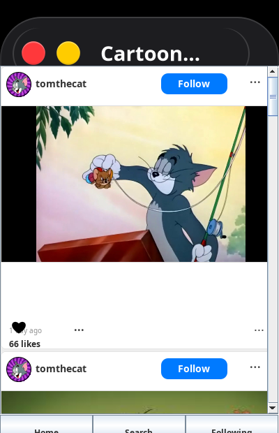

# CartoonGram

**University project — 3rd year, Observer Design Pattern**

**Team:** Vleju Cosmin Eugen, Slătineanu Andreea-Elena

---

<p align="center">
  
  
  
  
</p>

---

## What's this?

A social network simulator built in Java Swing with cartoon characters as users. It's an implementation of the Observer design pattern — characters post content, and followers get notified in real time when someone they follow publishes something.

The feed shows posts from Tom (Tom & Jerry), Jake and Princess Bubblegum (Adventure Time), Gumball and Darwin (The Amazing World of Gumball). You can follow/unfollow, like posts (custom heart icon drawn with Java2D Bezier curves), and leave comments (animated slide-in section).

The follow system uses a custom Observer pattern — each character is a Subject with its own list of Observers. When you hit Follow, both the Followers window and the button itself update instantly, without the character knowing who follows it.

---

## How the Observer pattern works here

- **Subject** — each character (`FollowSubject`) holds a list of observers and a follow/unfollow state
- **Observers** — the `FollowButton` toggles its label, and a `Follower` object adds/removes the name from the Following window
- When you click Follow, `setFollowed()` triggers `notifyObservers()`, which calls `update()` on everything attached

---

## What it looks like

The UI is a 400×600 phone-like window with scrollable feed, profile pics, post images, follow buttons, likes, and a bottom nav bar. Custom drawn heart icon for likes (empty/filled states), smooth comment section animation, and an animated scroll-to-top button.

---

## Running it

```bash
git clone https://github.com/papadie23/CartoonGram.git
cd CartoonGram

# Compile (requires JDK)
javac -d bin src/pk1/*.java

# Run
java -cp bin pk1.GUIinit
```

Opens a 400×600 Swing window.

---

## Screenshots

### Main feed


### Comment section


### Following window


### Post transitions


### Follow state change


### Following window update


---

## Tech

Java, Swing, Java2D, custom Observer pattern

---

## Why we built this

Part of our 3rd year software engineering coursework — to understand how the Observer pattern works under the hood, applied to something fun rather than a boring tutorial example.
